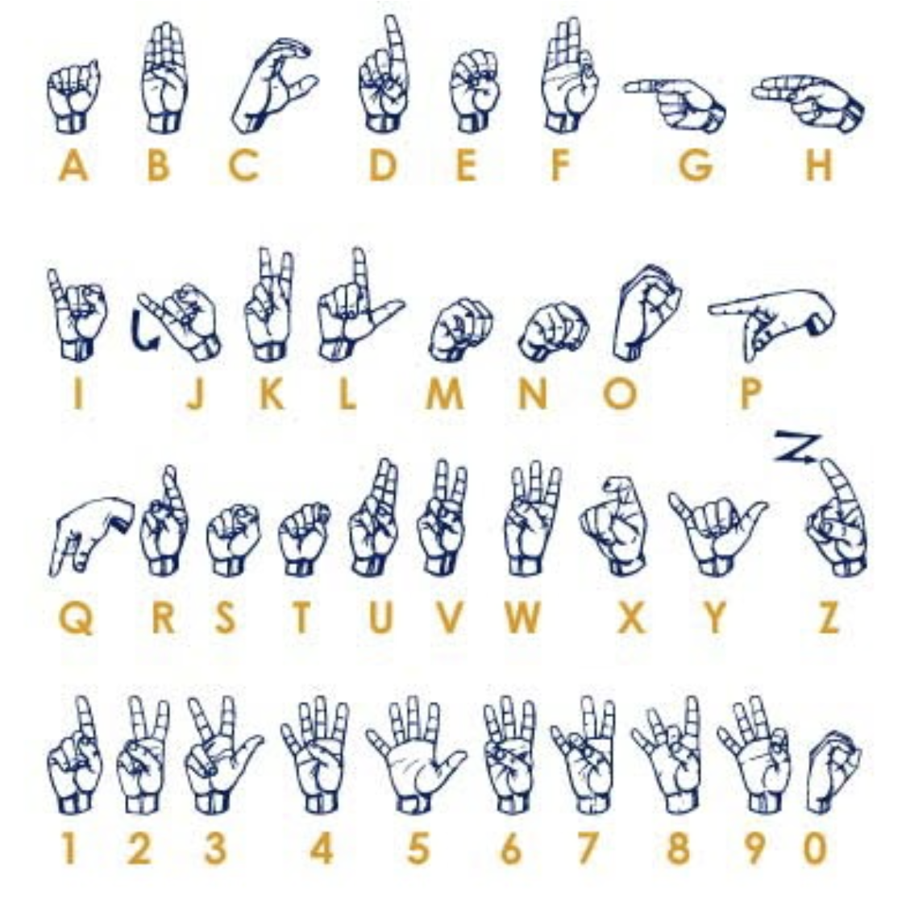
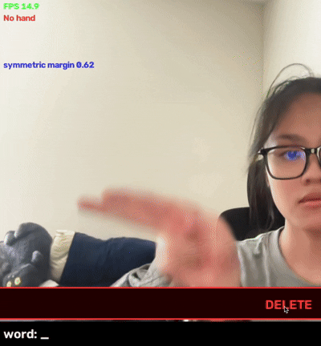
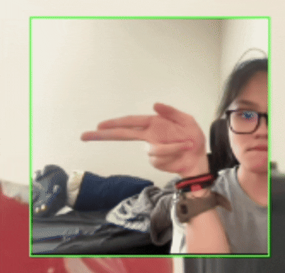
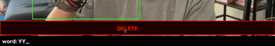
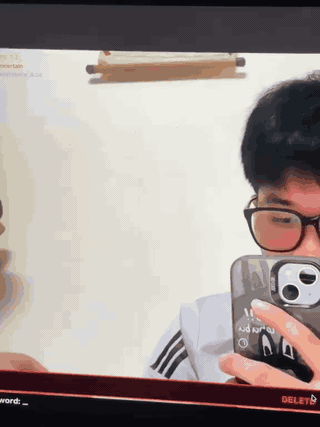

# DLQ — Deep Learning for Quiet Communication

Real-time ASL fingerspelling recognition from webcam input. EfficientNet-B0
transfer learning + MediaPipe hand localization, spelling words as text and
speech.



- **29-class** fingerspelling recognition (A–Z, space, delete, nothing)
- **EfficientNet-B0** + MediaPipe real-time pipeline
- **100%** on initial controlled live benchmark (46 samples, B and C)
- **Leakage-safe evaluation** to prevent adjacent-frame contamination
- **Framing-aware crop** derived from training-data statistics

> This is a **fingerspelling recognizer**, not sign-language translation. ASL is
> a full language with its own grammar; recognizing 26 static handshapes + a few
> control gestures is a narrow slice of it.



---

## The problem

Build a system that reads the ASL hand alphabet from a webcam and spells words
in real time. The dataset is 87,040 images (29 classes × 3,000 images) from
Kaggle — all **consecutive near-duplicate video frames of one signer in one
room** (GPL-2.0, `grassknoted/asl-alphabet`).

This dataset structure creates a subtle but critical evaluation trap.

---

## The accuracy lie

A random train/val split on this dataset reports **~99.9% accuracy**. That
number is meaningless.

Adjacent frames from the same recording are near-identical. A random split puts
neighbouring frames on both sides of the train/val boundary, so the model
essentially memorizes frame-to-frame similarity rather than learning handshape
features. The high accuracy is an artifact of temporal leakage, not
generalization.

This was discovered early and shaped the entire project. The fix: split each
class **by frame ranges** (first 80% of frames → train, last 20% → val),
implemented in `src/data.py::frame_range_split` and enforced by
`tests/test_split_leakage.py`. The split manifest is deterministic and
byte-for-byte reproducible (`data/split_manifest.json`).

---

## Honest evaluation: leakage-safe validation

With the leakage-safe split, the real numbers emerge:

| Metric | Value |
|---|---|
| Accuracy | **97.75%** (391 errors / 17,400 images) |
| Macro-F1 | **0.9775** |
| Per-class bar (≥85%) | 28/29 classes pass — **S is the outlier at 77.0%** |

The dominant error pattern is **S → E** (138 errors, 35.3% of all mistakes).
Other confusions: T → L (45), K → V (34), M → N (32), Y → I (30). These are
geometrically similar handshapes where small differences in thumb position or
finger curl are the only distinguishing features.

> **This is a dev-only number** — same signer, same room. The reported metric is
> the webcam test set, introduced below.

---

## Training images and webcam images look different

The model was trained on full 200×200 frames where the hand occupies ~45% of the
image. But a naive MediaPipe crop produces a tight bounding box where the hand
fills nearly the entire frame. This framing mismatch means the model sees
dramatically different input distributions during training versus inference.

The hypothesis: matching the training-set framing in the live crop should improve
real-world accuracy.

---

## Measuring the framing

`scripts/measure_training_framing.py` samples 580 training frames (20 per
class), runs MediaPipe hand detection, and measures the **hand-fill fraction**
— how much of the 200px image the hand's longest dimension spans.

Result: median hand-fill = **0.445** (the hand spans 44.5% of the image). To
reproduce this in a square webcam crop with margin `m`:

```
m = (1 / hand_fill − 1) / 2 = (1/0.445 − 1) / 2 = 0.6236 → 0.62
```

The full dataset (63,581 MediaPipe detections across all 87K images) confirms
the same ratios (`data/training_framing_all_summary.json`).

---

## Crop ablation: testing the hypothesis

Four crop strategies were benchmarked on 6,282 MediaPipe-detected validation
frames using `efficientnet_b0_targeted.pt`:

| Method | Accuracy | Macro-F1 |
|---|---|---|
| Original (raw 200×200, no crop) | 0.9775 | 0.9775 |
| **Symmetric (margin = 0.62)** | **0.9823** | **0.9845** |
| Calibrated (asymmetric L/R/T/B) | 0.9787 | 0.9799 |
| Forearm-preserving (bottom-heavy) | 0.9769 | 0.9780 |

**Symmetric 0.62 wins.** It reproduces the training-set hand occupancy and
improves accuracy over the raw frame by +0.48 percentage points. The asymmetric
"calibrated" crop better matches the training framing distribution but produces
worse classifier accuracy — a reminder that distribution matching and task
performance are not the same thing.

The crop formula (`src/crop.py::crop_square_with_margin`):

```python
side = max(bw, bh) * (1 + 2 * margin)   # margin = 0.62
cx, cy = bbox centre
square centred on (cx, cy), clamped to frame, resize to 224²
```

Reports: [`docs/reports/calibrated_crop_benchmark.json`](docs/reports/calibrated_crop_benchmark.json),
[`docs/reports/framing_reconstruction_error.json`](docs/reports/framing_reconstruction_error.json).

---

## Error analysis: S → E and the decision boundary

The 138 S → E errors were investigated across multiple hypotheses
([`docs/reports/s_to_e_investigation_timeline.md`](docs/reports/s_to_e_investigation_timeline.md)):

- **Not a preprocessing/exposure problem:** S frames are backlit (hand grey
  9–89 against background 240–255), but exposure normalization (lift experiment)
  was tested and found to help S while collapsing X → 0.72. An ablation
  confirmed the lift "was never helping."
- **Not a representation collapse:** In the 1280-D embedding space, all 138
  S → E errors are closer to correct-S (mean cosine 0.900) than to actual-E
  (0.606). The features are right; the decision boundary is wrong.
- **Classifier head boundary:** The S → E errors sit on the E side of the final
  `Linear(1280, 29)` S/E hyperplane (margin_SE mean −1.208), with 29/138 errors
  within 0.1 of the boundary. The issue is in the last linear layer, not the
  learned features.

Two fine-tuning approaches were tested to address this:

| Approach | S → E | V → K | Total errors | Verdict |
|---|---|---|---|---|
| Head-only FT (cached embeddings) | 138 → 134 | 13 → 14 | 391 → 390 | **No meaningful change** |
| Partial FT (last MBConv + head) | 138 → 98 | 13 → 54 | 391 → 398 | **Tradeoff** |

Partial fine-tuning improved S recall (0.770 → 0.837) but regressed V → K
(+41 errors). Total errors increased. This was honestly classified as a
tradeoff, not a win. Full analysis:
[`docs/reports/partial_finetune_targeted.md`](docs/reports/partial_finetune_targeted.md).

---

## Live webcam benchmark



The production pipeline: webcam → mirror → MediaPipe hand localization →
0.62-margin square crop → preprocess → EfficientNet-B0 → character prediction
→ temporal spelling logic → text + optional TTS.

**Controlled live benchmark** on `efficientnet_b0_targeted.pt`
([`data/livetest/`](data/livetest/)):

| Class | Samples | Accuracy |
|---|---|---|
| B | 21 | 1.000 |
| C | 25 | 1.000 |
| **Overall** | **46** | **1.000** |

This is a controlled benchmark with limited class coverage (B and C only) and
the same team members who built the system. It does not represent
signer-independent generalization. A broader 29-class webcam benchmark is
planned. See [Limitations](#limitations--next-steps).

---

## The pipeline

```
webcam frame
  → mirror
  → MediaPipe HandLandmarker (localization only, no centre fallback)
  → square crop (0.62 training-derived margin)
  → resize to 224²
  → ImageNet normalize (FROZEN contract)
  → EfficientNet-B0 (Dropout 0.3 → Linear 1280, 29)
  → confidence gate (threshold 0.30)
  → temporal stabilizer (hold ~0.5s to commit)
  → character / word bar
  → optional TTS
```

**Architecture:** EfficientNet-B0 (ImageNet-pretrained via timm), 4M parameters.
Two-stage transfer: freeze backbone → train head (LR 1e-3), then fine-tune all
(LR 1e-4). Cross-entropy with label smoothing 0.1, AdamW (wd 0.01), cosine +
warmup, AMP, early stopping.

**Preprocessing contract (FROZEN):** `src/crop.py::preprocess_bgr` — 224²
resize, ImageNet mean/std normalization. Any change requires sign-off from
both training and demo owners. Guarded by `tests/test_preprocessing_parity.py`.

---

## Results summary

| Evaluation | Purpose | Result |
|---|---|---|
| Naive/random split | Demonstrates leakage issue | ~99.9% (meaningless) |
| Leakage-safe dev-val | Honest offline evaluation | 97.75% acc, 97.75 F1 |
| Crop ablation (symmetric 0.62) | Validates production framing | 98.23% on 6,282 detected frames |
| **Controlled live webcam** | **End-to-end behavior (B, C)** | **100% (46/46)** |

---

## Testing & reliability

This repository contains tests across 25 files — not just conventional
unit tests, but **ML pipeline invariant tests** that guard against subtle
failures:

| Test suite | What it guards |
|---|---|
| `test_split_leakage.py` | No near-duplicate frames leak between train/val |
| `test_preprocessing_parity.py` | Training and live-app resize + normalize are identical |
| `test_webcam_bridge.py` | Crop geometry, margin, no-hand suppression, confidence gate |
| `test_forearm_crop.py` | Asymmetric margin math, clipping, crop-mode routing |
| `test_s_to_e_embeddings.py` | Embedding-neighbor diagnosis reproducibility |
| `test_s_to_e_head.py` | Classifier-head boundary analysis |
| `test_head_only_cached.py` | Head-only FT on cached embeddings |
| `test_partial_finetune.py` | Partial FT experiment reproducibility |

The split-leakage and preprocessing-parity tests are **load-bearing** — if
either fails, the PR does not merge.

---

## Repository structure

```
src/           Core pipeline: crop, data, augment, model, train, evaluate, export
app/           Live demo: webcam_speller.py (capture + spelling + HUD), tts.py
scripts/       Recording, analysis, benchmarking, framing measurement
tests/         ML pipeline invariant tests: split-leakage, parity, crop geometry, S→E diagnosis
models/        MediaPipe Tasks assets (hand_landmarker.task, selfie_segmenter.tflite)
data/          raw/ (gitignored) · webcam_testset/ · livetest/ · framing caches
checkpoints/   efficientnet_b0_{targeted,head_ft,partial_ft}.pt
docs/          Experiment reports, protocols, figures (see docs index below)
```

---

## Setup

Requires **Python 3.10**:

```bash
pip install -r requirements.txt        # mediapipe>=1.0, timm, torch, albumentations
```

MediaPipe needs `models/hand_landmarker.task` + `models/selfie_segmenter.tflite`
(committed; fetch with [`models/README.md`](models/README.md) if missing).

**For training** — get the Kaggle dataset and build the split:

```bash
kaggle datasets download -d grassknoted/asl-alphabet
unzip -q asl-alphabet.zip -d data/raw/
mv data/raw/asl_alphabet_train/asl_alphabet_train/del \
   data/raw/asl_alphabet_train/asl_alphabet_train/delete
python -m src.data --root data/raw/asl_alphabet_train/asl_alphabet_train --counts
```

Full conda/venv/Colab instructions: [`docs/SETUP.md`](docs/SETUP.md).

---

## Usage

```bash
# Train (two-stage transfer learning)
python -m src.train --root data/raw/asl_alphabet_train/asl_alphabet_train \
    --manifest data/split_manifest.json

# Evaluate — dev-val (NOT the reported metric)
python -m src.evaluate --checkpoint checkpoints/efficientnet_b0_targeted.pt \
    --split data/raw/asl_alphabet_train/asl_alphabet_train \
    --manifest data/split_manifest.json

# Evaluate — webcam benchmark
python -m src.evaluate --checkpoint checkpoints/efficientnet_b0_targeted.pt \
    --webcam data/webcam_testset --num-workers 0

# Export (TorchScript / ONNX)
python -m src.export --checkpoint checkpoints/efficientnet_b0_targeted.pt --format both
```

---

## Try the live demo

**Prerequisites:** Python 3.10, a webcam, and the checkpoint file.

```bash
# 1. Clone and install
git clone https://github.com/kcosteen/DLQ---Deep-Learning-for-Quiet-Communication.git
cd DLQ---Deep-Learning-for-Quiet-Communication
pip install -r requirements.txt

# 2. Run (no dataset required — just the checkpoint)
python -m app.webcam_speller \
    --checkpoint checkpoints/efficientnet_b0_targeted.pt
```

On macOS, add `--device mps` for GPU acceleration. The window shows your
webcam feed with a hand bbox overlay, the predicted letter, and a word bar
at the bottom. Hold a letter steady for ~0.5 s to commit it. Press `q` or
Ctrl-C to quit.

Useful flags:

| Flag | What it does |
|---|---|
| `--device mps` | Use Apple GPU (macOS only) |
| `--confidence 0.3` | Minimum confidence to accept a prediction (default 0.3) |
| `--camera 1` | Use a different webcam index |
| `--compare-full-frame` | A/B: compare crop-path vs full-frame prediction |
| `--debug` | Show per-frame timing and bounding box details |
| `--no-tts` | Disable text-to-speech output |

**Deleting a letter:** click the red DELETE strip at the top of the window, or
press Backspace / `b` on the keyboard.





---

## Limitations & next steps

**What this project is not:**

- **Not sign-language translation.** This recognizes 29 static fingerspelling
  gestures. ASL has grammar, facial expressions, and spatial grammar that this
  system does not address.
- **Not signer-independent.** The training data is one signer in one room. The
  live benchmark was captured by the same team that built the system. Broader
  generalization to diverse signers, lighting, and backgrounds is unvalidated.
- **Not production-ready.** CPU inference runs at ~5 FPS; MPS reaches ~16-18
  FPS. The 15-30 FPS target on CPU is not met.

**Remaining gaps:**

- S recall (~84% dev-val, 96% live) remains below the 85% per-class target.
  The decision-boundary analysis suggests the issue is in the final linear
  layer, not the learned features.
- MediaPipe detection coverage on the validation set is only 36.1% (ranges from
  12.2% for P to 98.7% for F). The crop ablation results are conditional on
  detection succeeding.
- Multi-signer / multi-environment evaluation has not been conducted.

---

## Docs index

| Document | Description |
|---|---|
| [`CURRENT_RESULTS.md`](docs/CURRENT_RESULTS.md) | Current state: checkpoints, tradeoff analysis, honest gaps |
| [`calibrated_crop_benchmark.json`](docs/reports/calibrated_crop_benchmark.json) | 4-way crop ablation results |
| [`framing_reconstruction_error.json`](docs/reports/framing_reconstruction_error.json) | Which crop best reproduces training framing |
| [`partial_finetune_targeted.md`](docs/reports/partial_finetune_targeted.md) | Partial-FT experiment (verdict: TRADEOFF) |
| [`partial_finetune_training.md`](docs/reports/partial_finetune_training.md) | Partial-FT training sweep |
| [`s_to_e_investigation_timeline.md`](docs/reports/s_to_e_investigation_timeline.md) | Full S→E diagnosis and what was ruled out |
| [`head_only_cached_embeddings.md`](docs/reports/head_only_cached_embeddings.md) | Head-only FT experiment |
| [`RESULTS.md`](docs/RESULTS.md) | Transfer-learning v1 results |
| [`RESULTS_class_fixes.md`](docs/RESULTS_class_fixes.md) | Aimed-augmentation class-fix work (V, X) |
| [`PREPROCESSING_CONTRACT.md`](docs/PREPROCESSING_CONTRACT.md) | FROZEN resize + normalize contract |
| [`WEBCAM_TESTSET_PROTOCOL.md`](docs/WEBCAM_TESTSET_PROTOCOL.md) | Webcam benchmark recording protocol |
| [`SETUP.md`](docs/SETUP.md) | Full setup, Kaggle, and Colab recipes |
| [`PROJECT_PLAN.md`](docs/PROJECT_PLAN.md) | Plan, milestones, ethics |
| [`REPORT_TEMPLATE.md`](docs/REPORT_TEMPLATE.md) | Final-report skeleton |

---

## Ethics

- This is an **alphabet recognizer, not sign-language translation.** Say so
  whenever you demo it.
- **Involve Deaf / signing users in testing.** A tool for a community should be
  evaluated by that community.
- **Be explicit about accuracy limits.** Report the honest webcam number and its
  failure modes, not the flattering split number.
- Fingerspelling is used in ASL mainly for names and loanwords; a fingerspelling
  reader is a small building block, not a communication replacement.

---

## License

Code: see `LICENSE`. **The ASL Alphabet dataset is GPL-2.0** — mind its terms
before any commercial use. The dataset is not redistributed in this repo;
download it yourself from Kaggle.

---

## References

- ASL Alphabet dataset — https://kaggle.com/datasets/grassknoted/asl-alphabet
- Google ASL Signs (word-level upgrade) — https://kaggle.com/competitions/asl-signs
- timm (PyTorch Image Models) — https://github.com/huggingface/pytorch-image-models
- MediaPipe — https://developers.google.com/mediapipe
- Albumentations — https://albumentations.ai
