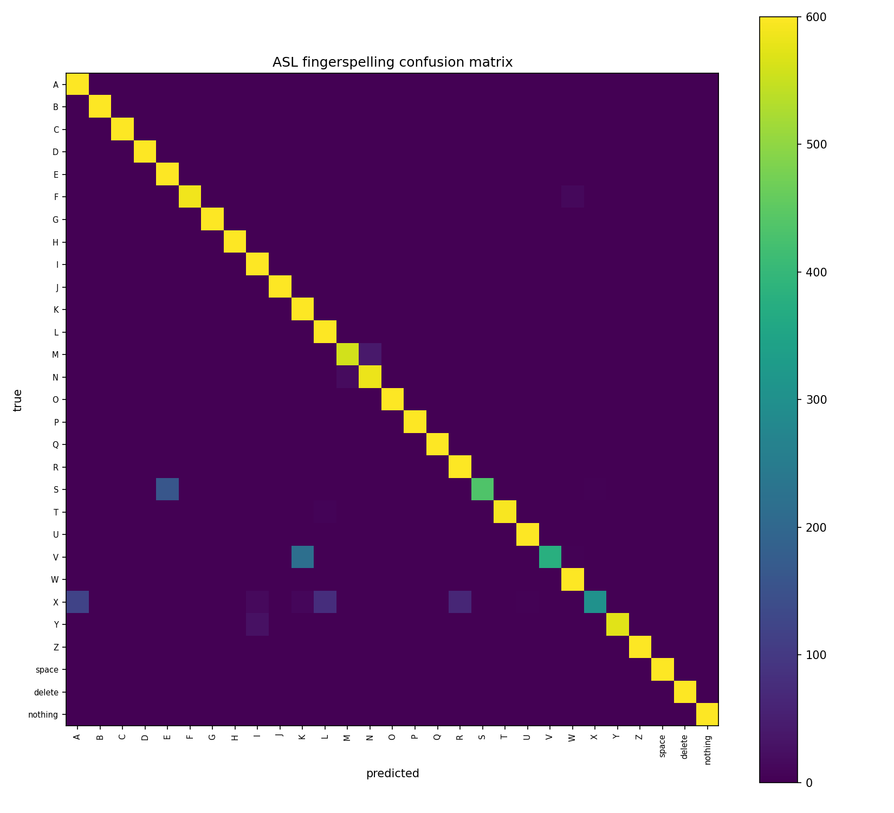

# Transfer learning v1 — results (#6)

**Run date:** 2026-08-03 · **Model:** EfficientNet-B0, two-stage · **Hardware:** Kaggle T4

> **This is the dev-val number, not the reported one.** Every figure below comes
> from the leakage-safe frame-range split: the same signer, the same room, the
> tail 20% of each class's frames. The metric this project reports is accuracy on
> our own webcam test set (#15/#16), which does not exist yet. Nothing here should
> be quoted as "the accuracy of the model".

## Headline

| Metric | Result | Target | |
|---|---|---|---|
| Dev-val accuracy (leakage-safe split) | **0.9545** | > 95% | ✅ |
| Macro-F1 | **0.9518** | — | |
| Worst per-class accuracy | **0.507** (X) | no class < 85% | ❌ |

**One target met, one missed.** Three classes — S, V and X — sit below the 85%
per-class bar. The overall number passes, which is exactly why the per-class bar
exists: 0.9545 on its own hides a class the model gets right barely half the time.

Two sanity checks on the number itself:

- **It is not ~99.9%.** A random split over these 87k near-duplicate frames
  reports a fake ~99.9%; landing at 95.45% is evidence the frame-range split is
  genuinely holding out unseen frames rather than leaking neighbours.
- **Evaluation reproduced the training split exactly** — 17,400 val images, the
  same count the training run reported, at 600 per class.

## Training behaviour

| Stage | Epochs run | dev-val |
|---|---|---|
| Head (backbone frozen, LR 1e-3) | 5 / 5 | 0.5611 → 0.6789 peak |
| Fine-tune (whole net, LR 1e-4) | 8 / 15 | 0.9043 → **0.9545** at epoch 3, then flat |

Early stopping fired after fine-tune epoch 8 (patience 5, best at epoch 3). The
saved checkpoint is epoch 3's weights.

The model reached its ceiling in three epochs of fine-tuning and then drifted
sideways. That is the single-signer dataset showing itself: with no augmentation
yet there is little left to learn after the signer's hands are memorised. The
remaining seven epochs would not have helped.

*Side effect worth knowing:* the cosine schedule was sized for 15 epochs, so at
epoch 8 the LR was still ~5e-5 and never reached its low-LR anneal. Matching
`--finetune-epochs` to the ~8 the model actually uses would let the schedule
complete, and is worth a try if this baseline is ever revisited.

## Per-class failures

Every class has exactly 600 val frames, so error counts are directly comparable.

| Class | Accuracy | Errors | Where they go |
|---|---|---|---|
| **X** | 0.507 | 296 | A 120, L 78, R 65, I 16, K 11, tail 6 |
| **V** | 0.630 | 222 | **K 219**, W 3 |
| **S** | 0.723 | 166 | **E 160**, X 4, A 2 |
| M | 0.932 | 41 | N 41 |
| N | 0.972 | 17 | M 17 |
| Y | 0.957 | 26 | I 26 |
| F | 0.977 | 14 | W 13, tail 1 |
| all others | ≥ 0.988 | 9 total | — |

**S, V and X account for 684 of the model's 791 errors — 86.5%.** The remaining
26 classes are effectively solved; 21 of them are at 1.000. This is not a
uniformly mediocre model, it is a near-perfect one with three blind spots.

Two distinct failure shapes:

- **V→K (219) and S→E (160) are clean collisions** — one wrong answer each,
  nearly every time. Both are genuinely similar handshapes (V and K differ mainly
  by thumb placement; S and E are both closed fists). A model that has only ever
  seen one person's version of them has no reason to separate them.
- **X is diffuse** — its 296 errors spread across A, L, R, I and K with no single
  culprit. That reads less like a specific lookalike and more like the model
  never forming a stable representation of X at all.



Full matrix: `docs/figures/confusion_matrix.csv`.

## The watch list was looking in the wrong places

The project plan named **M/N/S/T, A/E, K/V** as the confusions to watch. Measured:

| Predicted trap | Actual |
|---|---|
| K/V | ✅ real — the single worst collision (219) |
| M/N/S/T | ⚠️ mild — M↔N is 58 errors total; S's errors go elsewhere entirely |
| A/E | ❌ absent — both classes are at 1.000 |
| — | ❗ **S→E (160)** and **X→everything (296)**, neither anticipated |

Worse, the harness *structurally could not report* the second-largest failure:
S sat in the `M/N/S/T` group and E in `A/E`, so no group contained both, and
S→E was invisible however large it grew. X was in no group at all.

`WATCH_CONFUSIONS` has been updated with the measured groups, and `evaluate.py`
now also prints the largest off-diagonal cells unconditionally — a ranking taken
from the matrix itself cannot miss a confusion for being unanticipated.

## What this means for Week 3

Augmentation should be aimed, not uniform. In rough order of payoff:

1. **V vs K** — 219 errors, ~1.3 points of overall accuracy in one pair. Thumb
   position is the discriminating detail, so augmentation that preserves it
   (avoid aggressive rotation/shear that smears thumb geometry) matters more than
   augmentation volume.
2. **X** — the worst class and the least understood. Its diffuse errors suggest
   looking at the actual frames before choosing a fix; this may be a data problem
   rather than an augmentation one.
3. **S vs E** — 160 errors, same closed-fist family.

Left alone, these three classes will almost certainly be worse on the webcam set
than they are here, since a stranger's hand is a harder case than the training
signer's.

## Reproducing

```bash
python -m src.evaluate --checkpoint checkpoints/efficientnet_b0.pt \
    --split <asl_alphabet_train dir> --figures docs/figures
```

Checkpoints trained after #6 also write `checkpoints/<name>.split.json`; pass it
via `--manifest` to score the exact split that was held out rather than
re-deriving it. This run's checkpoint predates that, so its split was re-derived
— the matching 17,400 count is what confirms the two agree.
